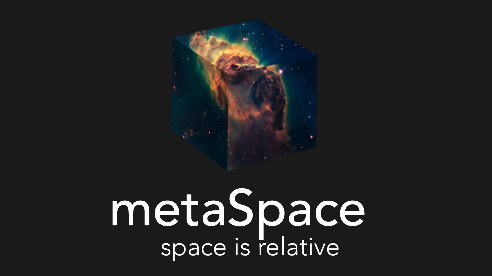
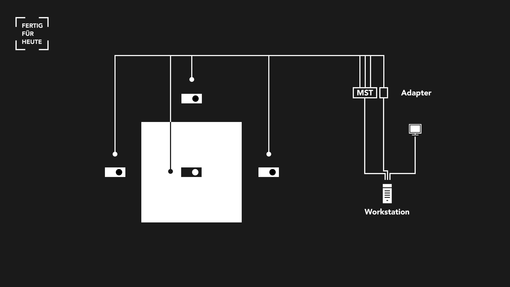
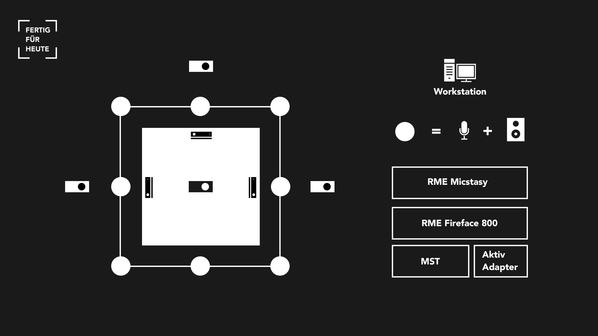

# metaSpace

metaSpace is a living concept of the future, where ambient intelligence is the essential element that independently designs the space. To do this, it recognizes the user's current context and adjusts the space to meet their needs.

This repository includes the software for a prototyping approach of the metaSpace concept using Max/MSP for auditory and vvvv for optical illusion.

## Setup

The room consists of a $3m^3$ construct. Walls are made of rear projection foils behind which projectors are mounted at a distance of two meters. Microphones and speakers are placed around the structure.

The optical effects created are rear projections that are displayed on three to four walls of the room. These are displayed in the room with geometric distortion correction, which is directed to the position of the user.

The acoustic effects are created with targeted sound reinforcement of the user and reverberation extension.

---

### Hardware

The project was originally implemented using the following hardware components.

#### Workstation and OS

- Mainboard: [GIGABYTE X58A-UD3R](https://www.gigabyte.com/de/Motherboard/GA-X58A-UD3R-rev-10/support#support-dl-driver)
- CPU: [Core i7-920](https://ark.intel.com/content/www/de/de/ark/products/37147/intel-core-i7-920-processor-8m-cache-2-66-ghz-4-80-gt-s-intel-qpi.html)
- RAM: 6GB DDR3
- GPU: [XFX Radeon HD 6950](https://www.mindfactory.de/product_info.php/2GB-XFX-Radeon-HD-6950-XXX-Aktiv-PCIe-2-1-x16--Retail-_765501.html)
- SSD: [Samsung Pro 850](https://www.samsung.com/de/memory-storage/sata-ssd/850-pro-sata-3-2-5-inch-ssd-256gb-mz-7ke256bw/)
- OS: [Windows 8.1 Pro](https://www.microsoft.com/de-de/software-download/windows8ISO) (64 Bit)

#### Projectors and Adapters

- 1x [Optoma GT750](https://www.beamershop24.de/de/optoma-gt750-de.html)
- 3x [BenQ W1080ST](https://www.beamershop24.de/de/benq-w1080st-1-de.html)
- 1x [Club3D MST-Hub](https://www.amazon.de/Club-3D-Transport-DisplayPort-Adapter/dp/B00KXYC9KC) (CSV-5300H: 1x miniDP -> 3x HDMI)
- 1x [Delock 4K Adapter](https://www.amazon.de/Delock-Adapter-Displayport-Stecker-schwarz/dp/B00TKOVOE8/) (active miniDP -> HDMI)
- 4x High Quality HDMI cable (2x 10m, 2x 10m)

#### Sensors and Adapters

- 3x [Microsoft Kinect](http://interface-experience.org/objects/microsoft-xbox-360-with-kinect/)
- 3x Active USB cable extension (1x 10m, 2x 15m)

The following schematic shows how the hardware components are organized and connected to each other:

At a distance of approx. 2 meters behind 3 of these screens, short-distance projectors (Benq W1080ST) are mounted on tripods at a height of approx. 4 meters. With the short-distance lens, content can be projected onto the screens over a wide area despite the short distance to the rear projection screens. Another short-distance projector (Optoma GT750) is located on a tripod above the wall opposite the entrance at a height of approx. 4 meters and illuminates the floor.

In order to be able to run 4 projectors and 1 display with the Radeon HD6950, a multi-stream transport hub (MST hub) had to be used. In this setup, the monitor was connected via DVI. The BenQ W1080ST projectors are connected via HDMI cables to a Club3D MST hub (CSV-5300H) which is connected to one miniDP output. The Optoma GT750 is connected directly via HDMI.

3 Microsoft Kinect sensors are mounted on the side wall and the wall opposite the entrance in order to be able to detect the user's position in the room. In order to cover as much of the room's surface as possible and to be able to determine the user's position at any point in the room, the Kinect sensors are mounted at an oblique downward angle.

#### Audio Equipment

- 8x directional microphones
- 8x [Adam A5X](https://www.thomann.de/de/adam_a5x.htm) loudspeakers
- [RME Micstasy](https://www.rme-audio.de/micstasy.html) (MicPreamp)
- [RME Fireface 800](https://archiv.rme-audio.de/products/fireface_800.php) (Audio Interface)

The following schematic shows how the audio components fit into the previous shown setup:

4 speakers radiate from the respective 4 corners of the walls. The remaining 4 speakers are located in the center of each wall. A sound system consisting of 8 loudspeakers, which provides sound to the occupant of the room and thus to the interactor. The 8 directional microphones are positioned above the 8 loudspeakers, each simulating a reflective surface. The 8 directional microphones are fed via an audio interface into the main computer, which processes the signals and plays them back through the speakers below.

---

### Software

The project was realized using the following software tools.

#### Visual: vvvv

[vvvv](https://vvvv.org/) is a multifunctional tool that is very well suited for prototyping, as it can be used to create multi-screen settings, projection mapping and 3D sceneries, as well as to control and read out motion sensors and micro-controllers. The fewer different software solutions have to be combined for a prototype, the fewer sources of error and problems can arise.

#### Audio: Max/MSP

[Max/MSP](https://cycling74.com/) is a very powerful tool for processing audio and other data. Unlike conventional DAWs, you are not bound to a channel layout or anything similar. You have full control over the signal flow of audio and control data. Max/MSP allows you to manipulate audio data on a mathematical level. In addition, you can also integrate all the plug-ins that are available to you in a conventional DAW. Max/MSP is therefore very well suited for the system, as the functions can be specifically tailored to the needs of the prototype and the setup.

#### Communication: OSC

With the [Open Sound Control (OSC)](http://opensoundcontrol.org/) protocol, it is possible to exchange control data with vvvv. This allows sound effects and processing to be matched to the image. In addition, the Max patch receives the user's position data from vvvv in order to implement further user position-dependent functions.

#### Control: TouchOSC

[TouchOSC](https://hexler.net/products/touchosc) is the original touchscreen MIDI and OSC control app. A fully modular control surface that runs on all iOS and Android devices. Send and receive Open Sound Control or MIDI messages over Wi-Fi to control all compatible software and hardware.

## Resources

### vvvv

- [vvvv beta](https://vvvv.org/downloads)

### Max/MSP

- [Cycling'74 Max/MSP](https://cycling74.com/downloads)
- [CNMAT Externals](https://cnmat.berkeley.edu/downloads)

### Drivers

- [RME FireFace](https://www.rme-audio.de/Downloadbereich.html)
- [Scarlet MixControl](https://customer.focusrite.com/en/support/downloads?brand=Focusrite&product_by_type=506&download_type=all)
- [MS Kinect SDK](https://developer.microsoft.com/de-de/windows/kinect/)

### TouchOSC

- [TouchOSC Editor](https://hexler.net/products/touchosc)
- [TouchOSC App](https://apps.apple.com/app/touchosc/id288120394)

## Documentation

Find the full project documentation at [fertigfuerheute.de](https://fertigfuerheute.de/)
